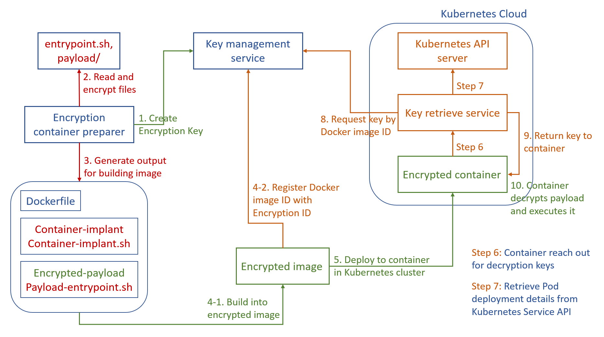

# laugh-tale

Kubernetes native secret container deployment tool

## Version

**Pre-Alpha**

## Motivation

Well-known container image protection for protecting sensitive image contents at rest,
usually requires following modification on the original workflow:
- Requires user to build container image with modified docker runtime 
- Requires modified docker runtime added to underlying cluster for decrypting image
- Requires configuring the storage driver of custom docker runtime to encrypt a single layer, otherwise the entire image is encrypted

It is neither user nor system administrator friendly for enabling such work flow.
For the reason that having custom built docker runtime can be overwhelming if the version of original
docker repository loses synchronization with custom repositories and results in unexpected behaviors.

Further more, most workload with sensitive executables are proprietary algorithms or computational models.
Such applications usually come with program runtimes (i.e. `R`, `MatLab`, `python`, `tensorflow` etc.) that take up
storage spaces out of proportion comparing to the application itself. For instance, [this](https://github.com/tensorflow/gan) tensorflow model is only 43MB download in zip file, while [tensorflow images](https://hub.docker.com/r/tensorflow/tensorflow/tags), the smallest CPU only version is ~550MB. Widely used runtimes are publicly available images that anyone can download. Encrypting it is like protecting a secret everyone knows, which is not an efficient approach.

## Solution

For addressing previously mentioned problem, `laugh-tale` is developed for providing encrypted workload images that:
- Has no dependency on custom built docker runtime
- Encrypts only files that are sensitive

## Overview

Step# | Description
------|-------------
1 | Request to create key with `Key management service`
2 | Read input files. These files must be formatted to a single `entrypoint.sh` script and a `payload` directory
3 | Generate encrypted output, only `payload` directory is encrypted. The output directory is ready to be build with `docker build` command. This step will also output `encryption key ID`
4-1 | Build encrypted container image with `docker build` and store it in a `docker registry`. From which one can retrieve docker `image ID`.
4-2 | Retrieve the docker `image ID`, with format `sha256:...`, and registry it with previously (step 3) generated `encryption key ID` in `Key management service`
5 | Deploy encrypted image to supported cluster (`Kubernetes`)
6 | After container started, `container-implant` will reach out to `key retrieve service` for decryption key. `key retrieve service` must be running in the same namespace and allowed certain access to `Kubernetes API server`
7 | `key retrieve service` requests `Kubernetes API server` for pod deployment detail. It will inspect the deployment looking for any possible vulnerability
8 | After making sure the deployment is clear of vulnerability, `key retrieve service` requests `Key management service` with docker `image ID`, which is provided in Step 7
9 | If the request succeed, `key retrieve service` return decryption keys to running container
10 | The `container-implant` escalates its privilege in container runtime, decrypts the payload and executes `entrypoint.sh`

## Components

### `roger`

Released as docker image, it is the program that prepares encrypted files and directory structure for
building encrypted images

### `poneglyph`

Released with `roger` as a part of its image. This is the program that will start inside containers deploy from
encrypted images and perform key fetching, decryption and execution.

### `kozuki`

Released as docker image, this is the service for managing encryption keys.

### `ohara`

**WIP**

Released as docker image, this service retrieves pod deployment details from Kubernetes API service and
submit the image ID to `kozuki` for retrieving decryption key.

## Planned features

### Key releasing policy

Current version does not verify pod deployment details other than `image ID`. Despite this complies with
the requirement of protecting sensitive container contents when it is at rest (stored as an image).
It does not stop unauthorized users from executing it. With `Policy` feature added, key manager will request
extra information on pod deployments for making the decision regarding if it should release decryption key.